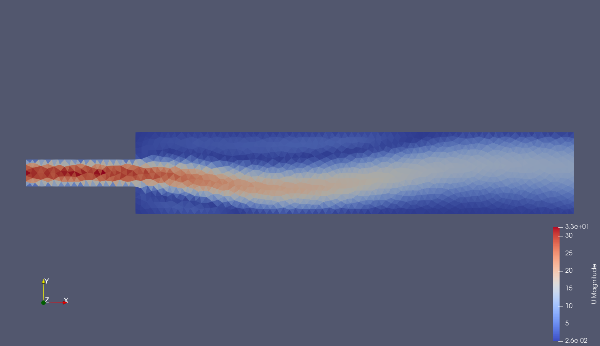

# TUTORIAL 19: BIFURCATION ANALYSIS FOR STEADY NS: case study on COANDA EFFECT
This is the case folder for a bifurcation analysis on the coanda effect.


<p align="center">
  <a href="https://en.wikipedia.org/wiki/Coand%C4%83_effect" target="_blank" >
    
  </a>
</p>


### 1. Prerequisites
- Install **ITHACA-FV** using the instruction in  (http://mathlab.github.io/ITHACA-FV/).
Move to the main ITHACA-FV folder and source the bashrc file as follow:
```
source etc/bashrc
```


### 2. Running the test case
This tutorial uses the shared libray object ITHACA_BIF which will is stored in $(FOAM_USER_LIBBIN) and whose implementation can be found in ITHACA-FV/src/ITHACA_BIF

After having compiled the library, one needs to compile the executable for the
test case, this can be done  with:

```
wmake
```

After having executed the former command an executable called
bifurcationNSS.exe will be created in the current directory. In order to run
the case you run:
```
./Allrun
```

In order to clean up the directory and removing the output data you can run:

```
./Allclean
```

### 2.  Important files and folders:

 mesh.sh: this is a basic bash script that allows changing the current mesh,
it must be run with one of the available option: refined, coarse, structured.
The relevant information are extracted from the utilities folder.
Example of usage

```
./mesh.sh coarse
```

 system folder: contains all the dictionary necessary to run the case, in
particular:
* [**BIFURCATION**]needed to set all the user defined bifurcation parameters
* [**ITHACAdict**] containing information about the POD phase
-ITHACAoutput: provided all the relevant ouputs of the program run, in
particular one can find the following subdirectoris:
* [**Offline**] which will contain the fields computed for the ROM problem during the online phase
* [**Online**] which will contain the fields computed for the ROM problem during the online phase
* [**POD**] containing information about the POD phase


